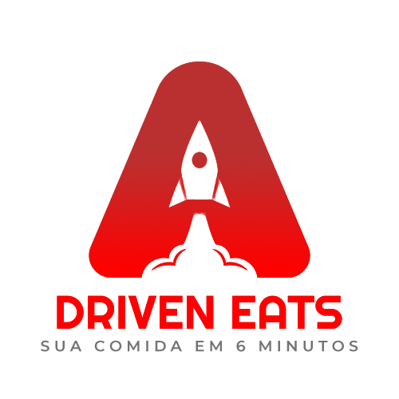
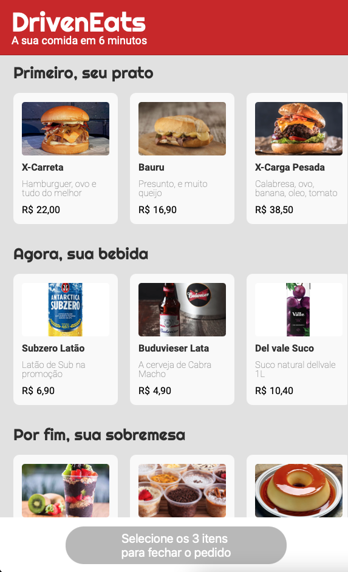
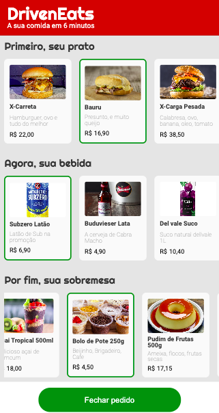
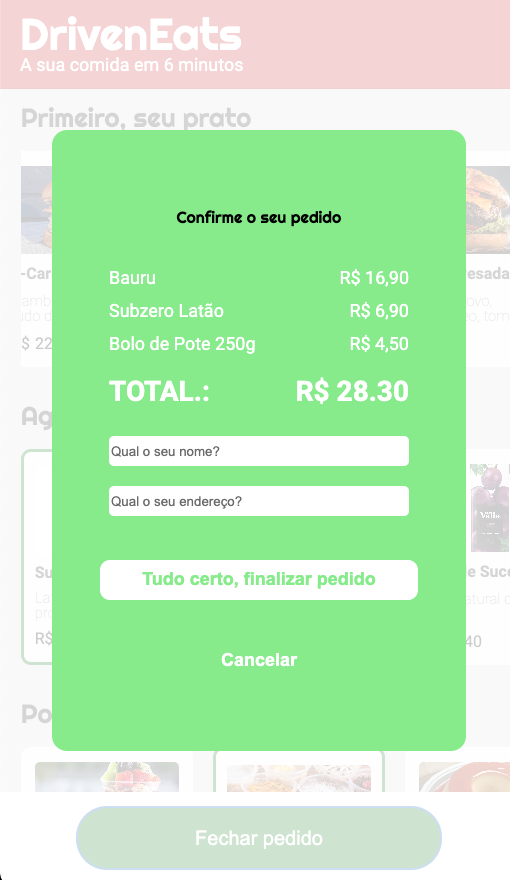
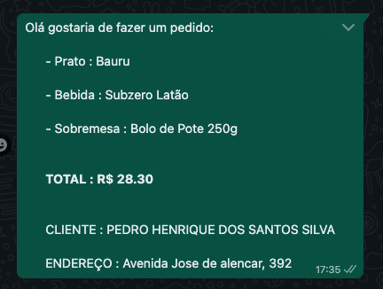

 
Peça agora o seu lanchinho para sair da fome em 6 minutos usando Driven Eats... 

## Driven Eats  🍔 🍟
Projeto desenvolvido para facilitar forma de solicitar pedidos, com apenas um clique faça seu pedido e aguarde o motoboy. 

## Tecnologias 
Algumas tecnologias usadas:

* HTML5
* JavaScript
* CSS

## Serviços
* Github

## Como usar?

### 1 - Quando você acessa, essa é a Tela Inicial.

 

### 2 - Selecione o seu Prato, depois sua Bebiba e por fim uma Sobremesa🍟

### 3 - Verifique os dados do seu pedido, adicione o nome e endereço.

 

### 4 - Confirme o seu pedido enviando a mensagem para o estabelecimento. 

 

## Recursos

Alguns recursos que são encontrados no projeto:
 - Fazer pedidos de forma rápida e simples.
 - Acabar com a fome de uma vez por todas.

## Links
  - Deploy on GitHub Pages: https://pedro-hen46.github.io/Driven-Eats/
  - Repositório: https://github.com/Pedro-Hen46/Driven-Eats

  ## Versionamento
  1.0.0

  ## Autores

  * **Pedro Henrique dos Santos Silva** 

   
  Me siga no <a href="https://github.com/login?return_to=https%3A%2F%2Fgithub.com%2FPedro-Hen46" target="_blank"><strong>Github</strong> </a> e Faça uma conexão no <a href="https://github.com/pedro-Hen46/" target="_blank"><strong>LinkedIn</strong> </a>.  
  Obrigado por visitar. ❤
